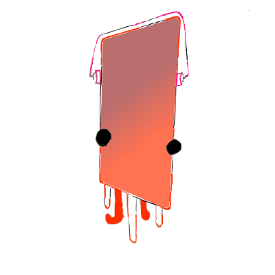

<h1 align="center" style="color:#FF6B6B;">Hi there! 👋</h1>

  

---

<h3 align="center" style="color:#FF6B6B;">💻 About Me</h3>

I'm Michael, a Junior at Cupertino High School. I love to code in my free time and enjoy building innovative projects. 
Besides coding, I am also a competitive swimmer. 
Hope you enjoy checking out my work!

---

<h3 align="center" style="color:#FF6B6B;">📊 GitHub Stats</h3>

  
  
  

---

<h3 align="center" style="color:#FF6B6B;">🚀 Skills & Tools</h3>

  
  
  
  
  
  
  
  
  
  
  
  

---

<h3 align="center" style="color:#FF6B6B;">🎵 Recently Played</h3>

  

---

<h3 align="center" style="color:#FF6B6B;">📈 Profile Views</h3>

  

---

<h3 align="center" style="color:#FF6B6B;">📫 Contact Me</h3>

🔗 GitHub: <a href="https://github.com/mchuang413" style="color:#FF6B6B
